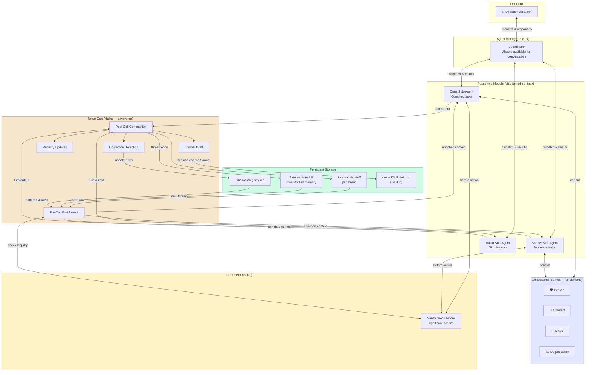
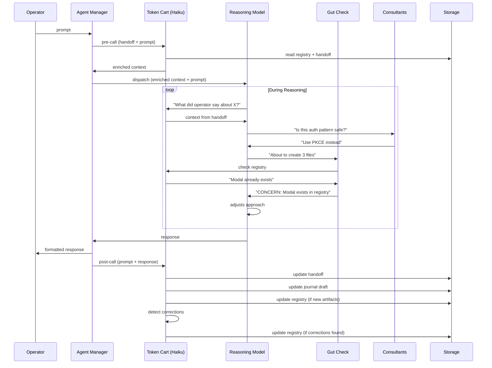

# Haiku Token Cart — Persistent Context Layer

> **Date:** 2026-04-02
> **Status:** Draft

## Goal

Replace the quadratic-cost full-history replay with a persistent Haiku token cart that tracks context across turns, enriches reasoning model inputs, and handles journaling — all at negligible cost.

## Problem

Every single-turn API call currently replays the full conversation history as context. By turn 10, the input includes turns 1-9 verbatim. Token consumption grows quadratically. On API this costs real money; on Max it burns rate limit headroom.

Additionally, journaling and context compaction are currently handled by the reasoning model (Sonnet/Opus) — expensive for structured, mechanical work.

## Architecture

### System Overview



### Turn Lifecycle (Detail)



### Three-Tier Model Hierarchy

| Model | Role | Cost (input/output per MTok) |
|---|---|---|
| **Haiku 4.5** | Always-on token cart — context tracking, pre-enrichment, post-compaction, live journaling | $0.25 / $1.25 |
| **Sonnet 4.6** | Final output polish — journal entries, GitHub issues/comments, documentation, PR descriptions | $3 / $15 |
| **Opus 4.6** | Heavy reasoning — main agent work | $15 / $75 |

### Turn Lifecycle

```
Turn 1 (no incoming handoff):
  User prompt
      ↓
  Haiku (pre-call): reviews prompt, produces enriched context
      ↓
  Reasoning model (system + enriched context + prompt) → response
      ↓
  Haiku (post-call): compacts prompt + response → handoff_1
  Haiku (journal): appends to running journal draft
      ↓
  handoff_1 stored in active_sessions[thread_ts]

Turn N (has incoming handoff):
  handoff_N-1 + user prompt
      ↓
  Haiku (pre-call): reviews handoff + prompt, surfaces relevant
         context, drops resolved items → enriched context
      ↓
  Reasoning model (system + enriched context + prompt) → response
      ↓
  Haiku (post-call): compacts handoff_N-1 + prompt + response → handoff_N
  Haiku (journal): updates running journal draft
      ↓
  handoff_N replaces handoff_N-1 in active_sessions[thread_ts]
```

### Compaction Recovery

When Opus 4.6 auto-compacts (hits context limits), it queries the Haiku token cart to recover critical context before continuing. Haiku has been tracking the full narrative and can provide:
- Key decisions made
- Current task state
- Critical details (file paths, error messages, user constraints)
- Open questions

This means compaction events don't lose context — Haiku is the institutional memory that survives.

### Session End & External Outputs

Sonnet 4.6 is the **final output layer** for anything external-facing. Haiku drafts, Sonnet polishes. This applies to:

| Output | Haiku drafts | Sonnet polishes |
|---|---|---|
| Journal entries | Running narrative from turn tracking | Blog-post quality, proper structure |
| GitHub issues | Structured title + body from context | Clean language, proper labels/format |
| GitHub comments | Raw update from task state | Professional, follows repo conventions |
| Documentation | Extracted facts and changes | Readable, follows doc style guide |
| PR descriptions | Diff summary + context | Clean summary + test plan |

Flow:
1. Haiku maintains running drafts throughout the session
2. When an external output is needed (session end, issue creation, etc.), Haiku's draft is passed to Sonnet 4.6
3. Sonnet polishes for language, structure, and best practices
4. Output is posted/committed

## Handoff Format

The handoff is a structured markdown document. No arbitrary token cap — strong instructions are the guardrail, not length limits.

```markdown
## Handoff Context
**Project:** {project_key}
**Turn:** {N}
**Task:** {one-line summary of what the user is working on}

### Decisions Made
- {bullet list — only confirmed decisions, not suggestions}

### Current State
{what's been done, what's pending, where we are}

### Critical Details
{anything the next turn MUST know — file paths, error messages, user-stated constraints, requirements}
{include verbatim quotes from the user when they state requirements}

### Open Questions
{unresolved items, things that need clarification}
```

## Haiku System Prompts

### Pre-Call Enrichment

```
You are a context enrichment agent. Given a conversation handoff and a new user prompt, produce a focused context injection for the reasoning model.

Rules:
- Surface ONLY context relevant to the new prompt
- If the handoff mentions topics unrelated to the new prompt, omit them
- Preserve all file paths, error messages, and user-stated constraints verbatim
- Do not infer, expand, or editorialize
- Do not add suggestions or opinions
- Output the enriched context as a concise markdown block
```

### Post-Call Compaction

```
You are a conversation compaction agent. Given the previous handoff (if any), the user's prompt, and the model's response, produce an updated handoff document.

Rules:
- Follow the Handoff Context template exactly
- Extract ONLY what was discussed — do not infer or expand
- If the user stated a constraint, include it verbatim
- Carry forward unresolved items from the previous handoff
- Drop items that have been resolved in this turn
- Never drop file paths, error messages, or user-stated requirements
- If a decision was made, record it. If a suggestion was offered but not confirmed, do not record it as a decision
```

### Journal Draft

```
You are a journal drafting agent. After each turn, update the running journal draft for this thread.

Rules:
- Track what was asked, what was done, and what was learned
- Write in past tense, third person
- Include specific details: file names, function names, error messages
- Note anything surprising or non-obvious
- Keep entries concise — one paragraph per turn, accumulating
- This draft will be polished by a stronger model at session end
- Target: docs/JOURNAL.md in the project repo (committed to GitHub)
```

### Journal Target: GitHub, Not Slack

Slack free plan has a 90-day message history limit and no canvas support. Journals must not depend on Slack for persistence.

**Primary:** `docs/JOURNAL.md` in the project repo — committed to git, permanent, searchable, version-controlled.

**Secondary (optional):** GitHub Discussions on the project repo — for richer threading and discoverability beyond the repo.

**Slack:** Thread responses only (ephemeral). The "Churned" block and conversation live in Slack, but nothing in Slack is treated as a persistent record. If Slack history expires, nothing is lost.

Flow:
1. Haiku maintains a running journal draft in memory throughout the thread
2. On session end, Sonnet polishes the draft
3. Polished entry is committed to `docs/JOURNAL.md` via git
4. Optionally posted to GitHub Discussions if configured

## Storage

```python
active_sessions[thread_ts] = {
    "handoff": str,           # latest handoff markdown
    "journal_draft": str,     # Haiku's running journal
    "turn_count": int,        # for the handoff Turn: field
    "project_key": str,       # for journal routing
}
```

In-memory only. Threads die on bot restart (same as today). Persistence is a future enhancement.

## Haiku Call Pattern

All Haiku calls are **async / fire-and-forget** where possible:
- **Pre-call enrichment:** synchronous (blocks before reasoning model call — must complete first)
- **Post-call compaction:** async (response already posted to Slack, compaction runs in background)
- **Journal draft:** async (bundled with post-call compaction in single Haiku call)

Post-call compaction and journal draft can be combined into one Haiku call with a system prompt that produces both outputs in structured sections.

## Cost Analysis

Per turn:
- Pre-call Haiku: ~1200 input tokens (handoff + prompt), ~300 output → $0.0007
- Post-call Haiku: ~2000 input tokens (handoff + prompt + response), ~500 output → $0.0012
- **Total per turn: ~$0.002**

For a 10-turn thread:
- Current (full history replay on Sonnet): ~27k input tokens → $0.081
- With Haiku token cart: ~5k Sonnet input + 20 Haiku calls → $0.015 + $0.020 = $0.035
- **Savings: ~57% on a 10-turn thread, increasing with longer threads**

Session-end Sonnet journal polish: one call, ~$0.01

## Fallback

If a Haiku call fails (API error, timeout):
- **Pre-call failure:** fall back to passing raw handoff text as context (no enrichment)
- **Post-call failure:** retain previous handoff unchanged. Next turn will work with stale-by-one-turn context
- **Never block the user.** Haiku failures are silent — the reasoning model always runs

## Integration Points

- `bot_unified.py` → `handle_project_message`: wire pre/post Haiku calls around the `quick_reply` call
- `active_sessions` dict: change from `list[dict]` to the new structure
- `tools/session_backend.py`: add `HaikuSidecar` class encapsulating all Haiku calls
- `tools/journal_writer.py`: accept Haiku draft + Sonnet polish flow
- System prompts in `agents/project_agent.py`: update to expect handoff context format instead of raw history

## Inline Code Review (Self-Healing)

Baked into the post-call Haiku step — no extra API calls. Haiku is already reading the full turn (prompt + response). Adding a code review check to that same call is free.

### Flow

```
Reasoning model produces response (may include code changes)
    ↓
Haiku (post-call — bundled with compaction + journal):
    1. Compacts → handoff
    2. Updates journal draft
    3. Scans for code issues:
       - Obvious bugs (unclosed resources, missing returns, off-by-one)
       - Security (hardcoded secrets, unsanitized input, injection vectors)
       - Consistency (naming doesn't match surrounding code, wrong patterns)
    ↓
  Clean → no action
  Flag  → next turn gets: "⚠ Review flag: {issue}" prepended to handoff
    ↓
  Reasoning model sees flag → self-heals on next interaction
```

### What Haiku Does NOT Review

- Architecture decisions (too complex for Haiku)
- Performance optimization (needs deeper reasoning)
- Business logic correctness (needs domain understanding)

These stay with the heavyweight review — `StagedPeerReview` for explicit review requests, or Sonnet at PR/commit time.

### Escalation

If Haiku flags a **security issue**, it gets elevated:
- Added to handoff with `🔴 SECURITY:` prefix
- Reasoning model is instructed to address security flags before continuing
- If unfixed after one turn, Sonnet reviews the flag at session end

## Channel Agent Teams

Each project channel gets a **team of specialist agents** at different model tiers. The reasoning model (Opus) is the primary worker, but it has consultants available — cheaper models running specific roles that it can query without burning Opus tokens.

### Team Composition Per Channel

| Role | Model | Purpose | When consulted |
|---|---|---|---|
| **Primary agent** | Opus 4.6 | Main reasoning, code changes, complex analysis | Every turn |
| **Sidecar** | Haiku 4.5 | Context tracking, compaction, journaling, inline review | Every turn (bundled) |
| **Infosec consultant** | Sonnet 4.6 | Security review, threat modeling, auth/crypto patterns | On code changes touching auth, crypto, input handling, or when Haiku flags security |
| **Architect consultant** | Sonnet 4.6 | API design, data model review, dependency decisions | On new modules, schema changes, or cross-project concerns |
| **Output editor** | Sonnet 4.6 | Polish for GitHub issues, docs, journals, PR descriptions | Session end, issue creation, PR submission |

### How Consultation Works

Consultants are **not always-on**. They're invoked by the token cart when specific triggers are detected:

```
Haiku post-call analysis:
    "Did this turn touch auth/crypto/input handling?"
        → Yes: invoke Infosec consultant (Sonnet)
    "Did this turn introduce a new module/schema/API?"
        → Yes: invoke Architect consultant (Sonnet)
    "Is an external output being produced?"
        → Yes: invoke Output editor (Sonnet)
    → No triggers: no consultant calls, zero extra cost
```

### Trigger Detection

Haiku detects triggers from the response content — not from explicit user commands:

| Trigger | Signal in response | Consultant |
|---|---|---|
| Auth/security | File paths containing `auth`, `login`, `session`, `token`, `crypto`, `password`; mentions of sanitization, validation, CORS, CSRF | Infosec |
| Architecture | New file creation, class/module definitions, schema changes, dependency additions | Architect |
| External output | GitHub issue creation, PR description, journal entry, documentation update | Output editor |

### Consultant System Prompts

Consultants receive:
1. The current handoff context (from Haiku)
2. The specific code/content to review
3. A focused system prompt for their role

They return structured feedback that gets folded into the handoff for the next turn. The reasoning model sees it as context, not as a separate conversation.

### Cost Control

- Consultants use **Sonnet** ($3/$15 MTok) — 6x cheaper than Opus
- Triggered only when relevant — most turns invoke zero consultants
- Each consultant call is scoped: only the relevant code/content, not the full conversation
- Estimated: 1 in 4 turns triggers a consultant → ~$0.01 per consultation → ~$0.0025 amortized per turn

### Core vs Discoverable Roles

**Core roles** — every project gets these, no configuration needed:

| Role | Model | Always present |
|---|---|---|
| Primary agent | Opus 4.6 | Yes |
| Token Cart | Haiku 4.5 | Yes |
| Infosec consultant | Sonnet 4.6 | Yes |
| Architect consultant | Sonnet 4.6 | Yes |
| Output editor | Sonnet 4.6 | Yes |

**Discoverable roles** — bootstrapped from the project's structure:

| Role | Discovered from | System prompt shaped by |
|---|---|---|
| Tester | Test files, CI config, test framework | `pytest`/`XCTest`/`jest`/etc. — framework-specific assertions and patterns |
| Linter | `.eslintrc`, `.swiftlint.yml`, `pyproject.toml` | Project's actual lint rules and style config |
| Dependency auditor | `Package.swift`, `package.json`, `requirements.txt` | Platform-specific dependency risks |
| Accessibility reviewer | UI files (`.xib`, `.storyboard`, SwiftUI views, React components) | Platform accessibility standards |

### Agent Bootstrapping

When a project is first configured (or when Shellack detects the project structure has changed significantly), Haiku scans the repo to discover what's there:

```
Project onboarding / structure change detected:
    ↓
Haiku scans:
    - Test files: tests/, __tests__/, *Tests.swift, *.test.ts
    - CI config: .github/workflows/, .gitlab-ci.yml, Jenkinsfile
    - Package files: Package.swift, package.json, requirements.txt, Cargo.toml
    - Lint config: .eslintrc, .swiftlint.yml, pyproject.toml [tool.ruff]
    - UI files: *.xib, *View.swift, *.tsx, *.vue
    ↓
Haiku produces a team manifest:
    {
      "tester": {
        "detected": true,
        "framework": "pytest",
        "test_dir": "tests/",
        "run_cmd": "venv/bin/pytest -q",
        "patterns": ["conftest.py fixtures", "mock-heavy, no integration DB"]
      },
      "linter": {
        "detected": false
      }
    }
    ↓
Discovered agents are created with framework-specific system prompts
```

### Mature Project Import

When someone imports a project that's already mature (has tests, CI, lint, docs), Shellack auto-bootstraps the full team on first interaction:

1. User adds project to `projects.yaml`
2. First `@Shellack` mention in that channel triggers bootstrapping
3. Haiku scans the repo structure (fast — just file listing + key config files)
4. Discovers test framework, CI setup, lint rules, UI patterns
5. Creates tester/linter/etc. consultants with project-specific system prompts
6. Stores the team manifest in `active_teams[channel_id]`

For a fresh project with no tests yet:
- No tester agent created initially
- When the user first asks about tests or Haiku detects test files being created, the tester agent bootstraps automatically
- "The team grows with the project"

### Per-Channel Customization

Teams are configured in `projects.yaml` (optional — bootstrapping handles defaults):

```yaml
projects:
  alpha:
    name: Alpha
    channel_id: C_ALPHA
    team:
      primary: opus-4-6          # default
      token-cart: haiku-4-5         # default
      consultants:
        # Core (always present, can override model or disable)
        - role: infosec
          model: sonnet-4-6
        - role: architect
          model: sonnet-4-6
        - role: output-editor
          model: sonnet-4-6
        # Discoverable (auto-detected, can override)
        - role: tester
          model: sonnet-4-6
          run_cmd: "venv/bin/pytest -q"  # override auto-detected command
```

Channels can disable consultants they don't need (e.g., a docs-only project might skip infosec), upgrade a consultant to Opus for high-stakes repos, or override auto-detected settings.

## Project Registry — Living Pattern Index

### Problem

Agents scan the codebase looking for existing components, patterns, and utilities — and often miss them. They create custom CSS when design tokens exist, build new modals when a `<Modal>` component is in the design system, write raw fetch calls when there's a shared API client. This wastes tokens on codebase scanning, produces inconsistent output, and creates cleanup work.

### Solution

A **Project Registry** — a structured, auto-populated index of everything reusable in the project. Stored as a lightweight file in the project repo. Agents consult it before creating anything new.

```
project-root/
  .shellack/
    registry.md          # The living index
```

### Registry Structure

```markdown
# Project Registry

## UI Components
| Component | Path | Props/API | Notes |
|---|---|---|---|
| Modal | src/components/Modal.tsx | `open`, `onClose`, `title`, `children` | Use for all dialogs. Do NOT create custom modals |
| Button | src/components/Button.tsx | `variant: primary|secondary|ghost`, `size: sm|md|lg` | Always use — never write custom button styles |
| Card | src/components/Card.tsx | `padding`, `elevation`, `children` | Standard container |

## Design Tokens
| Token | Value | Usage |
|---|---|---|
| --color-primary | #3B82F6 | Primary actions, links |
| --color-surface | #1E1E2E | Card backgrounds, panels |
| --radius-md | 8px | Standard border radius |
| --space-4 | 16px | Standard padding/gap |

## Shared Utilities
| Utility | Path | API | Notes |
|---|---|---|---|
| apiClient | lib/api.ts | `get()`, `post()`, `put()`, `delete()` | All API calls go through this. Handles auth, retries, error formatting |
| formatDate | lib/utils/date.ts | `formatDate(date, format)` | Use instead of raw Intl or moment |
| useAuth | hooks/useAuth.ts | `{ user, token, logout }` | Single source of auth state |

## Data Models
| Model | Path | Key fields |
|---|---|---|
| User | models/User.ts | `id`, `email`, `role`, `createdAt` |
| Project | models/Project.ts | `id`, `name`, `ownerId`, `status` |

## API Patterns
| Pattern | Example | Rule |
|---|---|---|
| Error handling | `try { await apiClient.post() } catch (e) { toast.error(e.message) }` | Always use apiClient error format, never raw try/catch with custom messages |
| Data fetching | `useSWR('/api/projects', fetcher)` | Use SWR for all client-side data fetching, never useEffect+fetch |
| Form validation | `zodSchema.parse(formData)` | Zod for all validation, never manual if-checks |

## Architecture Rules
| Rule | Scope | Rationale |
|---|---|---|
| No inline styles | All components | Use design tokens via Tailwind classes or CSS variables |
| No new dependencies | Global | Ask before adding any npm/pip/SPM package |
| Components must be reusable | UI layer | Every component should accept props, never hardcode content |
| Observable state only | State management | Use observable/reactive patterns (SwiftUI @State, React hooks, signals) — no imperative state |

## Swift-Specific (example for iOS projects)
| Pattern | Rule |
|---|---|
| Views | SwiftUI only, `@MainActor`, prefer `@State`/`@Binding` over `@ObservedObject` |
| Navigation | `NavigationStack` with typed paths, never `NavigationLink(destination:)` |
| Networking | `async/await` with shared `APIClient`, never completion handlers |
| Persistence | SwiftData `@Model`, never raw Core Data |
```

### How It's Maintained

**Auto-population (Haiku post-call):**

As part of the post-call analysis, Haiku checks:
- Did this turn create a new reusable component? → Add to registry
- Did this turn establish a pattern (error handling, data fetching)? → Add to registry
- Did this turn add a design token or shared utility? → Add to registry

```
Haiku post-call:
    1. Compaction → handoff
    2. Journal draft update
    3. Code review scan
    4. Registry update check:
       "Was a reusable artifact created or modified?"
       → Yes: append to .shellack/registry.md
       → No: skip
```

**Manual curation:**

The operator can edit `registry.md` directly — add architecture rules, design system tokens, or "never do X" instructions. These are authoritative and override any auto-detected patterns.

**Bootstrap on import:**

When a mature project is imported, Haiku scans for existing patterns as part of agent bootstrapping:
- Reads component directories, looks for export patterns
- Reads config files (tailwind.config, tsconfig, Package.swift)
- Reads existing style files for design tokens
- Produces an initial registry draft

### How Agents Use It

**Pre-call enrichment includes the registry.** Before the reasoning model runs, Haiku's pre-call step:

1. Reads the prompt to understand what's being asked
2. Identifies which registry sections are relevant (UI work → components + tokens, API work → utilities + patterns)
3. Injects the relevant registry sections into the enriched context

The reasoning model sees:

```
## Available Components (from Project Registry — USE THESE, do not create new)
- Modal: src/components/Modal.tsx — props: open, onClose, title, children
- Button: src/components/Button.tsx — variant: primary|secondary|ghost

## Architecture Rules (MANDATORY)
- No inline styles — use design tokens
- Use apiClient for all API calls
- Use SWR for data fetching
```

This replaces "scan the codebase for components" with "here are the components, use them." Cheaper, faster, more reliable.

### Hard Rule in System Prompt

The reasoning model's system prompt includes:

```
CRITICAL: Before creating any new component, utility, pattern, or style:
1. Check the Project Registry provided in your context
2. If a matching artifact exists, USE IT — do not create a new one
3. If you need something that doesn't exist, create it as reusable and
   it will be added to the registry
4. NEVER write inline styles, custom CSS, or one-off implementations
   when a design system token or shared component exists
```

### Cost

Zero additional API calls. The registry is:
- Read by Haiku during pre-call (already happening)
- Updated by Haiku during post-call (already happening)
- A small markdown file (~2-5k tokens for a mature project) — negligible context cost

## Correction Feedback Loop

### Problem

The operator says "no, use the existing Modal" or "don't do that, use SWR." That correction lives in one thread and is forgotten by the next. The same mistake happens again.

### Solution

Haiku detects corrections during post-call analysis and routes them to the right place:

```
Haiku post-call:
    "Did the operator correct the agent's approach?"
    ↓
  Correction detected:
    - "Use X instead of Y" → update Project Registry (add rule or component)
    - "Don't do X" → update Project Registry (add architecture rule)
    - "I prefer X style" → update Project Registry (add pattern)
    - "That's wrong because..." → add to handoff as critical detail
    ↓
  Registry updated → all future turns in ALL threads see the correction
```

### Detection Signals

Haiku looks for correction patterns in the operator's messages:
- "No, use..." / "Don't..." / "Stop doing..." / "Instead, use..."
- "We already have..." / "There's already a..."
- "That's not how we..." / "The pattern is..."
- Operator reverts or replaces agent-generated code

### What Gets Updated

| Correction type | Destination | Example |
|---|---|---|
| "Use existing component X" | Registry → UI Components | "Use `<Modal>` from `src/components/`" |
| "Don't create custom CSS" | Registry → Architecture Rules | Rule: "No custom CSS — use Tailwind utilities" |
| "We use SWR, not useEffect" | Registry → API Patterns | Pattern: "SWR for data fetching, never useEffect+fetch" |
| "That API is deprecated" | Registry → Shared Utilities | Update utility entry with deprecation note |
| Workflow preference | Handoff → carried forward | "Operator prefers small commits, not one big PR" |

This closes the loop: corrections aren't just heard, they're remembered.

## Cross-Thread Persistence (External Handoff)

### Problem

Thread handoffs die when the thread dies. Learnings from one conversation don't carry to the next. The agent starts fresh every time.

### Solution

When a thread ends (idle timeout, explicit close, or no activity for a configured period), Haiku produces an **external handoff** — a summary that persists beyond the thread and is available to future threads on the same channel.

```
Thread ends:
    ↓
Haiku (external handoff):
    Reviews the final internal handoff + journal draft
    Extracts what should persist:
      - Decisions that affect future work
      - Patterns discovered
      - Corrections received
      - Unfinished work / open items
    ↓
Stored in .shellack/thread-memory/{project_key}.md
    ↓
Future threads:
    Haiku pre-call reads thread-memory for the project
    Injects relevant persistent context
```

### External Handoff Format

```markdown
## Persistent Context — {project_key}
**Last updated:** {timestamp}

### Recent Decisions
- {decisions from recent threads that affect future work}

### Learned Corrections
- {corrections the operator made — these also go to the registry}

### Open Items
- {things that were discussed but not completed}

### Project State
- {current branch, recent changes, known issues}
```

### Lifecycle

- **Created:** when a thread ends (Haiku post-thread)
- **Updated:** merged with existing persistent context (not replaced — Haiku reconciles)
- **Read:** by pre-call enrichment on every new thread in that channel
- **Pruned:** Haiku periodically reviews and drops stale items (resolved issues, completed work)

### Relationship to Project Registry

The registry holds **patterns and rules** (reusable, structural). External handoffs hold **state and context** (temporal, evolving). They complement each other:

| | Project Registry | External Handoff |
|---|---|---|
| Contains | Components, patterns, rules | Decisions, state, open items |
| Lifespan | Permanent until changed | Evolving, prunable |
| Scope | Whole project | Recent work context |
| Updated by | Haiku post-call + corrections | Haiku post-thread |

## Agent Manager — Intelligent Task Dispatch

### Problem

When multiple messages arrive simultaneously, the bot spawns parallel Opus calls with no coordination. No prioritization, no dependency awareness, no model selection.

### Solution

The primary agent in each channel acts as an **Agent Manager**. It stays available for conversation and dispatches work to sub-agents at the appropriate model tier based on complexity.

```
Operator messages arrive:
    ↓
Agent Manager (always Opus — lightweight coordination):
    1. Assesses each task:
       - Complexity? (simple / moderate / complex)
       - Dependencies on other tasks?
       - Can it run in parallel with current work?
    2. Dispatches sub-agents:
       - Simple/monotonous → Haiku sub-agent
       - Moderate complexity → Sonnet sub-agent
       - Complex/multi-file → Opus sub-agent
    3. Stays free for conversation while sub-agents work
    ↓
Sub-agents report back → Agent Manager synthesizes results
```

### Model Selection Heuristics

The Agent Manager (via token cart analysis) determines complexity:

| Signal | Complexity | Dispatched to |
|---|---|---|
| Single file read/explain | Simple | Haiku |
| Formatting, renaming, mechanical refactor | Simple | Haiku |
| Bug fix in one module, write tests | Moderate | Sonnet |
| New feature touching 2-3 files | Moderate | Sonnet |
| Multi-file refactor, architecture change | Complex | Opus |
| Cross-project concern, security-sensitive | Complex | Opus |

### Parallel Dispatch

When tasks have no dependencies, the Agent Manager dispatches them in parallel:

```
Operator: "Fix the login bug, update the README, and add tests for the API client"
    ↓
Agent Manager:
    Task 1: "Fix login bug" → Sonnet sub-agent (moderate, touches auth)
    Task 2: "Update README" → Haiku sub-agent (simple, documentation)
    Task 3: "Add API tests" → Sonnet sub-agent (moderate, test writing)
    
    Tasks 1 and 3 touch different files → parallel
    Task 2 is independent → parallel
    All three dispatched simultaneously
    ↓
Agent Manager stays available:
    Operator: "Actually, the login bug might be related to the session timeout"
    Agent Manager: adds context to Task 1's sub-agent
```

### Sub-Agent Context

Each sub-agent receives:
- The current handoff context (from token cart)
- Relevant registry sections (from pre-call enrichment)
- Task-specific instructions from the Agent Manager
- Project system prompt

Sub-agents do NOT get the full conversation history — only what the token cart determines is relevant. This keeps sub-agent costs minimal.

### Cost Impact

Instead of one Opus call per message regardless of complexity:

| Scenario | Current cost | With Agent Manager |
|---|---|---|
| "What does this function do?" | Opus ($0.015) | Haiku ($0.001) |
| "Fix this test" | Opus ($0.015) | Sonnet ($0.005) |
| "Redesign the auth system" | Opus ($0.015) | Opus ($0.015) |
| 3 tasks in parallel | 3x Opus ($0.045) | Haiku + 2x Sonnet ($0.011) |

### Concurrency Control

- Max parallel sub-agents per channel: configurable (default: 3)
- Queue with priority ordering when at capacity
- "Queued — you're next" message posted to thread
- Agent Manager never queues — always available for conversation

## Gut Check Agent

### Purpose

Before Opus executes a significant action (writing code, creating files, making architectural decisions), a cheap model does a quick sanity check: "Does this plan actually make sense?"

This catches the moments where Opus confidently heads in the wrong direction — wrong file, wrong pattern, misunderstood requirement, about to overwrite something important.

### When It Triggers

Not every turn — only before **significant actions**. The token cart detects action signals:

| Signal | Example | Gut check? |
|---|---|---|
| About to create new files | "I'll create a new Modal component..." | Yes — does one already exist? |
| About to modify multiple files | "Let me update the auth flow across 4 files..." | Yes — is this the right scope? |
| About to delete or replace code | "I'll replace this implementation..." | Yes — is anything depending on it? |
| About to add a dependency | "Let me install lodash..." | Yes — is there a native alternative? |
| Simple question/answer | "The function is on line 42" | No |
| Single-line fix | "Change `==` to `===`" | No |

### Flow

```
Opus produces a plan/intent (before execution):
    ↓
Token cart detects significant action signal
    ↓
Gut Check agent (Haiku or Sonnet — configurable):
    Input: Opus's stated plan + registry context + handoff
    Prompt: "Quick sanity check. Anything wrong with this plan?
             Check against: registry, handoff, project structure.
             Reply PROCEED or CONCERN: {one-line reason}"
    ↓
  PROCEED → Opus continues
  CONCERN → concern injected into Opus's context:
            "⚠ Gut check: {concern}. Reassess before proceeding."
    ↓
  Opus addresses the concern or proceeds with justification
```

### What It Checks

- **Registry compliance:** Is Opus about to create something that already exists?
- **Scope creep:** Is the plan doing more than what was asked?
- **Consistency:** Does the approach match established patterns?
- **Risk:** Is anything being deleted or overwritten that might be in use?
- **Requirements:** Does the plan actually address what the operator asked?

### Cost

- Model: Haiku by default ($0.0005 per check), upgradable to Sonnet for critical projects
- Only triggers on significant actions (~1 in 3 turns)
- Amortized: ~$0.0002 per turn
- The cost of catching one wrong-direction mistake pays for hundreds of gut checks

## Communication Model — Bidirectional, Not Waterfall

### Principle

This system is **not a pipeline**. It is not: prompt → enrich → reason → compact → done. Every agent can consult any other agent at any point during execution. The cheap agents exist specifically to enable this — frequent, low-cost back-and-forth is the design, not an edge case.

### Interaction Patterns

```
                    ┌──────────────┐
                    │   Operator   │
                    └──────┬───────┘
                           │
                    ┌──────▼───────┐
               ┌───►│ Agent Manager│◄───┐
               │    └──┬───┬───┬───┘    │
               │       │   │   │        │
          ┌────▼──┐ ┌──▼─┐ │ ┌─▼─────┐ │
          │Gut    │ │Token│ │ │Consul-│ │
          │Check  │◄►Cart│◄►│►tants  │ │
          └───────┘ └──┬─┘ │ └───────┘ │
                       │   │           │
                    ┌──▼───▼──┐        │
                    │ Reasoning│────────┘
                    │  Model   │
                    └──────────┘

    ◄► = bidirectional consultation
```

Every arrow is bidirectional. Examples:

| From | To | Why |
|---|---|---|
| Reasoning model | Token cart | "What did the operator say about auth in the last thread?" |
| Token cart | Gut check | "Opus is about to create a new component — does one exist?" |
| Gut check | Token cart | "I flagged a concern — add it to the handoff" |
| Consultant (infosec) | Reasoning model | "This auth pattern has a vulnerability — here's the fix" |
| Reasoning model | Consultant (architect) | "Should I split this into two modules?" |
| Agent Manager | Token cart | "What's the current state? Can I dispatch this in parallel?" |
| Token cart | Consultant (tester) | "New code landed — what tests are needed?" |
| Reasoning model | Token cart | "Update the registry — I created a new shared utility" |

### This Is Not Optional

The system prompt for every agent includes:

```
You are part of a collaborative agent team. You can and should consult
other agents when:
- You're unsure about project patterns → check the registry via token cart
- You're about to make a significant change → request a gut check
- You're touching security-sensitive code → consult infosec
- You're creating architecture → consult architect
- You need context from prior work → query the token cart

Do NOT proceed in isolation when consultation would improve the outcome.
Consultation is cheap. Mistakes are expensive.
```

### Why This Works Economically

The cheap agents (Haiku at $0.25/MTok) make frequent consultation viable:

| Interaction | Cost | Without consultation |
|---|---|---|
| 5 Haiku consultations per turn | ~$0.003 | One wrong-direction Opus turn: ~$0.03 + redo |
| Token cart + gut check + registry lookup | ~$0.002 | Agent creates duplicate component: 15 min cleanup |
| Infosec spot check | ~$0.005 | Security bug ships to production: hours of remediation |

The math: 10 cheap consultations cost less than 1 wasted Opus turn. Always consult.

## Feature Configuration

All features in this spec are **opt-in and configurable**. On first setup, Shellack walks the operator through a simple onboarding flow. Features can be toggled anytime via `@Shellack config` or in `projects.yaml`.

### Onboarding Flow

When a new project is added and the operator first interacts:

```
Welcome to Shellack! Let me set up your project.

🔄 Token Cart (context compaction)
   Reduces token cost by compacting conversation context between turns.
   → Enable? [on/off] (default: on)

📋 Internal Handoff
   Maintains context within a thread across turns.
   → Enable? [on/off] (default: on)

📤 External Handoff  
   Carries learnings across threads — decisions, corrections, open items.
   → Enable? [on/off] (default: on)

👥 Agent Manager
   Dispatches parallel sub-agents at the right model tier for each task.
   → Enable? [on/off] (default: off — single-agent mode)

✅ Gut Check
   Quick sanity check before significant actions.
   → Enable? [on/off] (default: on)

🔍 Code Review
   Inline review after each turn (self-healing).
   → Enable? [on/off] (default: on)

🛡️ Consultants (infosec, architect, tester)
   Specialist agents consulted when relevant triggers are detected.
   → Enable? [on/off] (default: on)

📚 Project Registry
   Auto-maintained index of components, patterns, and rules.
   → Enable? [on/off] (default: on)

💰 Cost Observability
   Track and display token spend per turn/thread/channel.
   → Enable? [on/off] (default: on)
```

### Configuration in projects.yaml

```yaml
projects:
  alpha:
    name: Alpha
    channel_id: C_ALPHA
    features:
      token-cart: true           # context compaction
      internal-handoff: true     # within-thread context
      external-handoff: true     # cross-thread persistence
      agent-manager: false       # single-agent mode by default
      gut-check: true            # sanity check before actions
      code-review: true          # inline self-healing review
      consultants: true          # specialist agents
      registry: true             # project pattern index
      cost-observability: true   # spend tracking
    team:
      primary: opus-4-6
      token-cart: haiku-4-5
      gut-check: haiku-4-5      # upgradable to sonnet-4-6
      consultants:
        - role: infosec
          model: sonnet-4-6
          enabled: true
        - role: architect
          model: sonnet-4-6
          enabled: true
        - role: output-editor
          model: sonnet-4-6
          enabled: true
```

### Runtime Toggle

Features can be toggled mid-session without restarting:

```
@Shellack config gut-check off
@Shellack config agent-manager on
@Shellack config consultants off
@Shellack config show
```

### Minimal Mode

For users who want the simplest setup:

```yaml
features:
  token-cart: true
  internal-handoff: true
  # everything else defaults to false
```

This gives basic context compaction with zero overhead. Features layer on as the operator needs them.

## Cost Observability

The token cart tracks every API call across all tiers. This data is surfaced to the operator:

### Per-Thread Summary

Included in the "Churned" block at the end of each turn:

```
✻ Churned for 12s · $0.014 (↑2.1k ↓890 tokens)
```

### Per-Channel Dashboard

Available via `@Shellack usage`:

```
📊 Alpha — Last 7 days
  Turns: 47
  Cost: $0.83
    Opus: $0.62 (75%)
    Sonnet: $0.18 (22%)
    Haiku: $0.03 (3%)
  Avg cost/turn: $0.018
  Token cart savings: ~$1.40 vs full-history replay
```

### Alerts

Token cart monitors for unusual spend:
- Thread exceeding $0.50 → warning in thread
- Channel exceeding daily budget (configurable) → DM to operator
- Single turn exceeding $0.10 → flagged in handoff for awareness

## What This Does NOT Cover

- The `run:` streaming path (MaxBackend sessions) — separate enhancement, but token cart and agent manager patterns apply when implemented
- Persistence across bot restarts — future work (Redis/SQLite for handoffs and registry)
- Message UX redesign (tag system, rendering) — separate spec, builds on top of this
